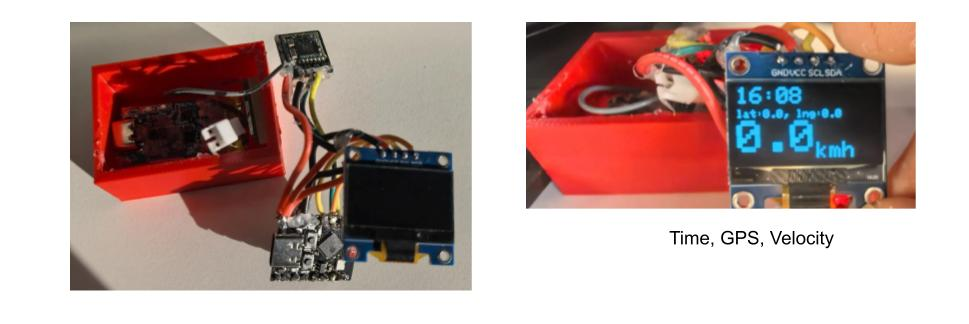

# ESP32 Gps Speedo


use  [ESP32 C3 Supermini board](https://randomnerdtutorials.com/getting-started-esp32-c3-super-mini/), [Box 3d STL model](https://www.tinkercad.com/things/17OVYhJvpWT-esp32-c3-speedo) with :

* 500 mAh battery.
* Type C battery charge module.
* GTU8 gps module.
* SSD1306 LED display.




## Build

prepare arduino
```
curl -fsSL https://raw.githubusercontent.com/arduino/arduino-cli/master/install.sh | sh
export PATH=~/Arduino/bin:$PATH
```

build the project
```
./scripts/build_base.sh esp32c3 ttyACM0 GpsSpeedo
```

run monitor:
```
arduino-cli monitor -p /dev/ttyACM0 -c baudrate=115200 -b esp32:esp32:esp32c3
```


### debug mode

set `BOARD_OPTIONS="--board-options CDCOnBoot=cdc"` and `#define DEBUG_MODE`.
